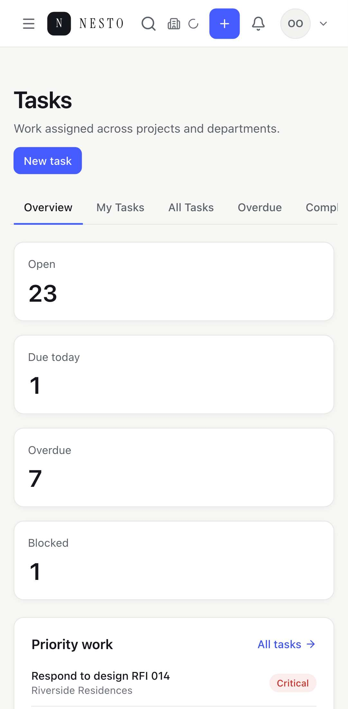
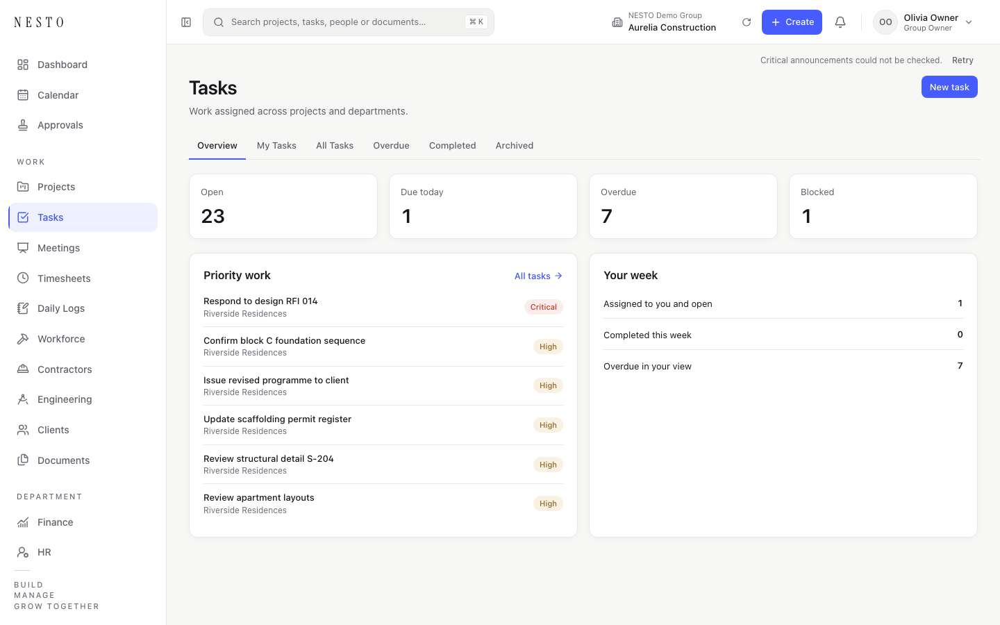
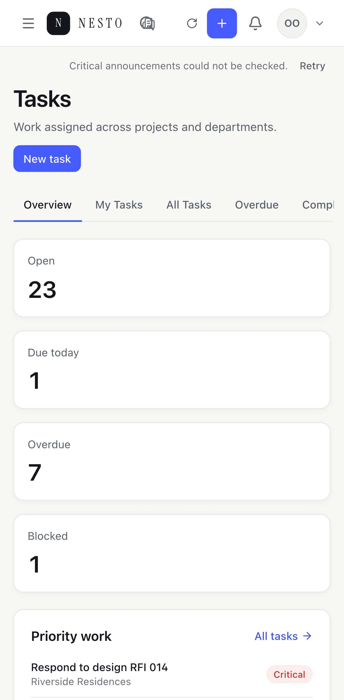

# NAV-02 release evidence — Faster Server Loading

This is the implementation review evidence §20 of the NAV-02 PRD asks for, in
its order. The decisions behind the change are in
[ADR 0013](../adr/0013-nav-02-faster-server-loading.md). NAV-01's evidence,
which this phase builds on, is in
[NAV-01-release-evidence.md](NAV-01-release-evidence.md).

## Tested build

| | |
| --- | --- |
| Change | NAV-02 commits on `main` (see the release-readiness entry, §36) |
| Baseline | `cb18f231`, `main` after NAV-01, built the same way and run on the same data |
| Build | `next build --turbopack` + `next start`: Next.js 15.5.25 with its bundled React 19.2.0-canary-0bdb9206-20250818 |
| Browser | Playwright 1.63.0, headless Chromium 153.0.8010.12 |
| Machine | Apple M5, 10 cores, 16 GB, macOS; local Postgres 16, no remote region |
| Data | Isolated database `nesto_nav`: `migrate deploy`, the default seed and the ARMAAR seed; no background workers |
| Instances | One `next start` per build; two of the NAV-02 build for the maintenance drill (§5) |
| Pool | Prisma's default, 21 connections per client |
| Cache state | Stated per measurement. No access data is cached across requests in either build |

## 1. Server dependency graph (§20 item 1)

**A document load.** It is the only request that runs the `(nesto)` layout
and the shell on the server. Soft navigation and prefetch render from the
page's segment down, so they pay only the page's own context resolution
(§3).

```
request
├─ page maintenance snapshot ........ started first; this process's, ≤ 5 s old  REQUIRED
├─ requireUserContext() ............. [user-context]                             REQUIRED
│   ├─ session → user, platform access, membership, company, group, role,
│   │  department (one nested include: 7 statements)
│   ├─ organization access .......... [org:{group}:{user}]
│   │  (grants, department assignments, group departments)
│   └─ enabled modules .............. [modules:{company}]
├─ admitPage(snapshot) ‖ pre-stream guard ... age checked again; an "enabled"
│                                             snapshot confirmed live            REQUIRED
└─ AppShell
    ├─ sidebar cookie                                                           REQUIRED
    ├─ resolveWorkspaceNavigation ... Group view only: the group's contexts,
    │                                 [group-contexts:{group}:{user}:{session}]  REQUIRED
    ├─ resolveShellCore ............. context key, active workspace, + Create's
    │                                 summary, Group entry; joins the group
    │                                 contexts above; at most one COUNT for
    │                                 "is there a choice"                        REQUIRED
    ├─ ⇢ workspace chooser slot ..... listWorkspaces, reusing the keys above     DEFERRED
    ├─ ⇢ critical banner slot ....... one findFirst, no COUNT                    DEFERRED
    └─ ⇢ access panel slot .......... development only; joins [org:…]            DEFERRED
```

Nothing marked DEFERRED is awaited before the frame. The client host settles
each slot after hydration (ADR 0013, decision 4).

**Before NAV-02,** `AppShell` awaited four things together: the navigation,
the full chooser, the announcement state (a banner find plus an unread
COUNT), and the development panel's grants. Maintenance was read after the
context, outside API error translation.

**An API request** (`withContext`, `withPlatformContext`):

```
request ─ runWithRequestScope
├─ maintenance, fresh read ........ [maintenance:fresh]; started first, awaited
│                                   after the context, inside error translation
└─ resolveUserContext ............. [user-context], as above
    handler
    └─ resolveGroupContexts ....... [group-contexts:…] → loadGroupMemberContexts:
                                    reuses [org:…] and [modules:{company}],
                                    batches only the unresolved companies
```

## 2. Context keys and their lifecycle (§20 item 2)

**Where a scope comes from:**

| Execution | Scope | Lifetime |
| --- | --- | --- |
| Server render (layout, page, shell) | React `cache` | The render |
| Route handler | `withContext` / `withPlatformContext` (AsyncLocalStorage) | The request |
| Job | `job.runner`, one per attempt; `system-context`, one per company run | The attempt / company run |
| Notification outbox | `notification.dispatch`, one per row | The row |
| Anything else | None | Every read is fresh |

**The keys:**

| Key | Holds | Reused by | Forgotten after |
| --- | --- | --- | --- |
| `user-context` | The verified context | Layout, pages, shell, handlers | A workspace switch (this key), and every write below (whole scope) |
| `org:{group}:{user}` | Grants, department assignments, group departments | Context build, group contexts, the development panel | Access grant and revoke; appointing a group head or company manager, adding, moving or ending a department member; a member's role, placement or status change |
| `modules:{company}` | Enabled module keys, seeded by the batch | Context build, group contexts | A module toggle |
| `group-contexts:{group}:{user}:{session}` | The group's company contexts | Group navigation, shell core, chooser, + Create, bell, search | Any of the writes above |
| `productivity-settings:{company}` | Announcements, favorites, recent work switches | Bell, search, dashboard, favorites, recent work | Updating those settings (this key) |
| `maintenance:fresh` | The authoritative maintenance state | Enforcement within the request | Never crosses a request |

- **Across requests:** nothing is kept. Every request starts empty, so a
  revoked session, grant or membership is seen by the next one (C09).
- **Failures:** they are shared inside the request that met them and never
  outlive it (C11).
- **Order:** the forgetting happens after the write commits. A write that
  fails keeps what the request had read (unit test "does not forget when the
  commit fails").

## 3. Statement counts (§20 item 3)

**How they were counted:**
- Postgres logged every statement on the isolated database
  (`log_statement = 'all'`).
- A probe then made each request once, signed in, and cut the log by byte
  offset around it.
- A prepared statement counts once, and each `BEGIN`/`COMMIT` counts as a
  statement.
- These are physical SQL statements, not Prisma calls, and one request ran at a
  time, so there is no attribution problem (PERF-01).

| Request | FINANCE (one company) before → after | OWNER (Group Owner of five companies, in one of them) before → after |
| --- | --- | --- |
| Document `/dashboard` | 126 → **111** | 431 → **416** |
| Document `/tasks` | 35 → **31** | 38 → **34** |
| `GET /api/workspaces` | 26 → **23** | 26 → **23** |
| `GET /api/activity-center/unread-count` | 76 → **62** | 116 → **102** |
| `GET /api/search/home` | 127 → **78** | 157 → **112** |
| `GET /api/quick-create/actions` | 14 → **14** | 17 → **17** |

**What went, FINANCE:**
- **Organization access** (grants, assignments, group departments) was read
  2–4 times per request. It is now read once.
- **Modules** are read once per company. The session's company is never read
  again by the batch.
- **The shell's announcement state** was a `COUNT` and a `FIND`. It is now
  one banner `FIND`: `/tasks` reads `announcements` once where it read it
  twice, and the dashboard twice where it read it three times (its own feed
  is the other read).
- **Productivity settings** on search: 30 → 15 statements. Every read of them
  is an upsert, now once per company per request (§8).
- **The dashboard's** settings reads: 9 → 3.

`/api/quick-create/actions` was already one context resolution, so its count
is unchanged. The OWNER's dashboard is mostly the executive dashboard's own
reads, which are NAV-03's.

**The structural budgets (PERF-02):**

| Criterion | Result | Where |
| --- | --- | --- |
| One assignments and one grants load per actor, group and request | Met | C01, C02; the traces above |
| Module flags once per company, unresolved ones batched | Met | C03, C05, "the batch leaves out the company the session already resolved" |
| Group contexts reused by navigation, chooser and + Create | Met | C04 |
| Shell unread-announcement COUNT | Zero | S11 (API), the traces |
| Optional slots | No parent await | §1; slot isolation in §4 |
| New background fetches while navigating | Zero | S09: ten navigations, no slot or + Create request |
| Warm page maintenance snapshot | Zero reads when fresh and off | M01 |
| Enforcement admission | A fresh read per request | M06 (unit), and one `platform_settings` statement on every API call in the traces |
| Page snapshot age | Never above 5 s when used | M02, M03, M16 |
| Scope isolation | No cross-user, session, company or group reuse | C08, C12, C14; keys carry every primitive (§2) |

## 4. Timing (§20 item 4)

### How it was measured

- **The benchmark:** `tests/e2e/perf/navigation-benchmark.spec.ts` with
  `NAV_BENCH_ONLY=documents`. Its profiles are NAV-01's:

  | Profile | Viewport | Network | CPU |
  | --- | --- | --- | --- |
  | Desktop | 1440×900 | 100 ms latency, 10/5 Mbps | 1× |
  | Phone | 390×844 | 150 ms latency, 4/1 Mbps | 4× slowdown |

- **The person:** the Group Owner (five companies), both in a company
  workspace and in the Group view.
- **What is timed:**
  - "Usable" is NAV-01's readiness marker, the page's heading visible after a
    document load.
  - "First byte" is `responseStart − requestStart`. Nothing is sent before the
    layout, the context, maintenance and the shell core are ready, so it
    stands in for `shell_core_ready_ms`. The server also records that metric
    now (`shell_core_ready_ms_total`).
- **Samples:** 30 per scenario. Both builds ran on the same machine and
  database, alternating run by run. Every sample reached its heading, so the
  error rate is 0.
- **Cache state:** the maintenance page snapshot was warm, since loads were
  under five seconds apart. Access was read fresh on every request in both
  builds.

### Document loads (NAV-01 → NAV-02, run 3)

**Desktop:**

| Scenario | Usable median | Usable p95 | First byte median | First byte p95 |
| --- | --- | --- | --- | --- |
| Cold entry `/dashboard` | 323 → 320 | 346 → 342 | 42 → **17** | 73 → **27** |
| Cold entry `/projects` | 205 → 198 | 259 → 256 | 24 → **16** | 36 → **24** |
| Cold entry `/finance/invoices` | 261 → 260 | 274 → 272 | 25 → **15** | 32 → **29** |
| Workspace switch → usable dashboard | 267 → 265 | 428 → 429 | — | — |
| Cold entry `/dashboard`, Group view | 265 → 268 | 318 → 398 † | 51 → **23** | 72 → **38** |

**Phone:**

| Scenario | Usable median | Usable p95 | First byte median | First byte p95 |
| --- | --- | --- | --- | --- |
| Cold entry `/dashboard` | 436 → 428 | 474 → 503 | 35 → **17** | 53 → **23** |
| Cold entry `/projects` | 414 → 401 | 428 → 421 | 19 → **13** | 22 → **16** |
| Cold entry `/finance/invoices` | 336 → 345 | 392 → 403 | 23 → **16** | 28 → **22** |
| Workspace switch → usable dashboard | 522 → 515 | 558 → 561 | — | — |
| Cold entry `/dashboard`, Group view | 524 → 529 | 539 → 544 | 44 → **21** | 50 → **24** |

All times are in milliseconds.

**The raw files** are in [`benchmarks/`](benchmarks/), as
`nav02-document-{build}-r{run}-{profile}.json`:
- `baseline` is NAV-01;
- `after` is NAV-02 as shipped;
- `suspense` is NAV-02's first version, runs 1 and 2 (Findings, 2).

The slot and concurrency files follow the same names.

**Against §16 (PERF-03):**

- **Shell-core-ready.** The baseline is already under 200 ms (24–51 ms
  median), so the objective is to keep that bound and show the structural
  reductions. The first byte falls by 30–60 % at the median and by 9–63 %
  at p95, in both profiles, Company and Group alike.
- **No regression above 10 %.** No usable-time median is more than 3 %
  slower than the baseline. No p95 is more than 7 % slower, except the
  desktop Group view (†).
- **† The desktop Group view's p95** was 398 and 366 in two runs, against 318
  twice. It is not a slower path:
  - **How loads land:** a load of that page lands in fixed modes, about 175,
    250, 325 and 400 ms. These come from React's 300 ms reveal hold and the
    frame it lands in. So a 30-sample p95 depends on whether one or two loads
    fall in the last mode.
  - **Probe with each load allowed to finish,** interleaving the builds sample
    by sample (60 each):
    - usable 324 → 330 median, 335 → 341 p95 (+1.8 %);
    - first byte 46 → 19;
    - end of the stream 155 → 154;
    - document size 58.1 → 58.7 KB.
  - **Probe with loads back to back,** as the benchmark does (80 each):
    - 2 loads against 5 landed in the 400 ms mode (Fisher's exact test,
      two-sided p = 0.44);
    - commit to content 215 → 222 ms at p95.
  - Nothing ran on the main thread long enough to count as a long task in
    either build.
  - The probe was a one-off, not kept as a spec. Its samples are in
    `benchmarks/nav02-group-view-probe-settled.json` and
    `nav02-group-view-probe-back-to-back.json`.

### Slow slots (PERF-03, second objective)

`tests/e2e/perf/server-load.spec.ts` with `NAV_SLOT_ISOLATION=1`. The build
ran with the test hook. It loaded `/tasks` as a document 30 times per cohort,
with the cohorts interleaved.

| Cohort | Usable median | Usable p95 | Added at the median |
| --- | --- | --- | --- |
| No delay | 97 | 119 | — |
| Chooser read +1 500 ms | 117 | 169 | **+20 ms** |
| Banner read +1 500 ms | 82 | 95 | **−15 ms** |

The objective is at most 100 ms added.
- **Where the chooser's 20 ms likely comes from:** the document stays open
  until the delayed answer has streamed. The page itself does not wait for
  the slot.
- **The first version,** with a Suspense boundary per slot, added −3 and
  −18 ms. It was dropped for the reason in Findings, 2.

### Twenty people at once (PERF-04 step 5)

Twenty signed-in people, each a different role, ran the same mix five times
at once: three document loads, the chooser API, the bell, search and
+ Create's menu. That is 800 requests per run.

| | NAV-01 run 1 | NAV-02 run 1 ‡ | NAV-01 run 3 | NAV-02 run 3 | NAV-02 run 3, pool of 42 |
| --- | --- | --- | --- | --- | --- |
| Wall time | 6 914 | 6 416 | 7 016 | 6 691 | 6 795 |
| Answers | 800 OK | 800 OK | 800 OK | 800 OK | 800 OK |
| `/dashboard` median / p95 | 372 / 613 | 375 / 597 | 346 / 635 | 381 / 609 | 359 / 627 |
| `/tasks` | 197 / 342 | 189 / 251 | 202 / 274 | 198 / 288 | 202 / 294 |
| `/projects` | 206 / 335 | 186 / 236 | 201 / 245 | 191 / 223 | 200 / 250 |
| `/finance` | 182 / 308 | 169 / 216 | 192 / 259 | 178 / 250 | 184 / 273 |
| `/api/activity-center/unread-count` | 108 / 203 | 89 / 166 | 119 / 194 | 90 / 175 | 97 / 187 |
| `/api/search/home` | 99 / 148 | 80 / 131 | 98 / 162 | 92 / 159 | 77 / 180 |
| `/api/quick-create/actions` | 48 / 85 | 48 / 84 | 56 / 83 | 46 / 103 | 56 / 107 |
| `/api/workspaces` | 67 / 101 | 74 / 162 | 73 / 111 | 65 / 149 | 63 / 142 |

‡ Run 1 of NAV-02 was its first version, with a Suspense boundary per slot.
The server's reads are the same as in the shipped version.

- **Errors:** no server errors, no refused connections and no pool timeouts
  in any run.
- **Connections:** one NAV-02 server holds at most 22, where one NAV-01
  server held 43 (§ Findings, 1).
- **Variation:** medians move by up to 10 % between runs of the same build,
  so only differences that repeat are read here.
- **What repeats:**
  - **The bell** is faster in both runs, and so are **`/projects`** and
    **`/finance`**.
  - **`/api/workspaces`** is slower at p95 in all three NAV-02 runs, while
    its median holds or improves.
    - It is not the pool: the run with NAV-01's 42 connections shows the
      same p95.
    - No screen calls it any more. The chooser now arrives in the document,
      and a Retry uses `/api/shell/workspaces`.
    - It stays in the table as a measured difference, outside the flows §16
      protects.
- **Not timed on their own:** login and write admission.
  - Their only NAV-02 change is that maintenance is read beside the context
    rather than after it.
  - They are covered for behavior in §7.

## 5. Maintenance on two instances (§20 item 5)

**`tests/e2e/shell/maintenance-two-instances.spec.ts`:** two `next start`
processes of the NAV-02 build on one database, 3 tests, all passed.

- **How the change arrives:** the drill writes the setting straight to the
  table, as a change committed on some third instance would reach these two.
  Neither instance is told.
- **M06, a change reaches both:**
  - the next API call on each instance is refused at once, from its fresh
    read;
  - pages on each land on `/maintenance` within five seconds, from their
    snapshots.
- **M12, no loop when switching off:** instance B holds an "enabled"
  snapshot, and maintenance is switched off, again untold.
  - `/dashboard` and `/maintenance` on B both land on the dashboard at once.
    The enabled snapshot is confirmed live before any redirect, and
    `/maintenance` reads live.
  - Nothing bounces between the two screens.
- **M12, M18, rapid toggles:** six writes alternate the setting while both
  instances load documents. Every load ends on `/dashboard` or `/maintenance`,
  never in a redirect loop, and both settle on the last committed state.

**The rest of the race and failure cases** use fake clocks and the real
reader in `tests/unit/maintenance/page-snapshot.test.ts` (17 tests):
- M01: reuse within five seconds;
- M02: an expired snapshot never served;
- M03: the age rechecked at admission;
- M04: one read for concurrent misses;
- M05: a read overtaken by a committed change discarded;
- M07: enforcement never joins a page read;
- M13: a failure with no snapshot fails closed;
- M14: a malformed value is an error;
- M15: no rows means off;
- M16: a late read cannot refill;
- M17: a throwing cache store;
- M18: reason precedence and rapid toggles;
- the bypass switch.

**The save path** is in `tests/api/platform/maintenance-propagation.test.ts`
(12 tests):
- M08: each flag refuses the next applicable admission, on the real routes;
- M09: the Platform Admin still reads and changes the setting under
  maintenance;
- M10: a rolled-back save publishes nothing;
- M11: a committed save whose page refresh fails reports
  `pageRefresh: "pending"`, and enforcement already sees it;
- V01: authentication's precedence over a failing maintenance read;
- V05: a failing maintenance or context read is a sanitized error with a
  request id.

A process restart empties the snapshot, and the next page reads the database
(M17).

## 6. Browser evidence (§20 item 6)

The pictures come from `tests/e2e/perf/navigation-evidence.spec.ts`
(`NAV_EVIDENCE=nav02`). The build ran with `NESTO_TEST_SHELL_DELAYS=1`, whose
test-only hook holds or fails a slot's read as a cookie says. They show the
Group Owner on `/tasks`.

| | Desktop | Phone (Pixel 7) |
| --- | --- | --- |
| Both slots held for 8 s: the page is usable, the workspace keeps its name with a spinner, the banner row is empty |  |  |
| Both slots failed: the workspace name stays, with Retry; the banner row says it could not check |  |  |
| After Retry on each: the switcher, and no banner |  |  |

In every state, + Create, the bell and the account menu stay where they are.

**`tests/e2e/shell/shell-slots.spec.ts`** (12 tests, production build with the
hook):

| Case | What it shows |
| --- | --- |
| S01 | A 4 s chooser: the page is usable in under 3 s, and the slot names the current workspace |
| S04 | A failed chooser keeps the workspace, and one Retry makes one `/api/shell/workspaces` request |
| S05 | A retry that answers first is not overwritten by the late first answer |
| S06 | A workspace switch while slots load: the new workspace's own answers only |
| S07 | While the chooser loads, the Group crumb is not yet a link, and the record page is not held |
| S02 | A late banner moves nothing, and the reserved region fits the tallest banner at every width |
| S09 | Ten navigations make no slot or + Create request |
| — | A person with one workspace gets no workspace control, then or later |
| S10 | A production build never mounts the development panel |
| S17 | The top bar fits 320 px; the pending control is the switcher's own size and does not spin under reduced motion |

## 7. Test results (§20 item 7)

### Vitest

**`vitest run`, all 240 files,** on a freshly seeded copy of the isolated
database:
- **4 399 passed, 1 failed, 11 skipped.**
- **The failure** is `procurement-service.test.ts` › "allows the same order
  number in another company". On the same fresh data it fails at the NAV-01
  baseline too, so it predates this change.
- **On the long-used lane database,** a further 15 seed and integrity checks
  fail on data the E2E runs had changed: ARMAAR people, `verify:organization`,
  and cross-company relations. The baseline fails them there too, and none
  fails on fresh data.

**The new suites, all passing:**

| Suite | Tests | Cases |
| --- | --- | --- |
| `tests/unit/context/request-scope.test.ts` | 8 | C07, C08, C11, CTX-04 |
| `tests/integration/context/request-scope-reuse.test.ts` | 11 | C01–C06, C08–C10, C12, C14 |
| `tests/unit/maintenance/page-snapshot.test.ts` | 17 | M01–M07, M12–M18 |
| `tests/api/platform/maintenance-propagation.test.ts` | 12 | M08–M11, V01, V05 |
| `tests/api/shell/shell-slots.test.ts` | 8 | S08, S11, S18, V03, COMPAT-01/02 |
| `tests/api/announcements/announcements.test.ts` | +3 | S11, S13, S16; S12, S14 and S15 by the existing cases |

C13 (default-workspace initialization) is covered by the unchanged
`tests/integration/auth/user-context.test.ts`.

### End-to-end, production build

- **The whole suite:** `next start` of the NAV-02 build with the slot hook,
  on the isolated database, gave **539 passed, 0 failed, 21 skipped**
  (10.9 min).
- **The skips** are the opt-in suites: the benchmarks, the pictures and the
  two-instance drill.
- **NAV-01's own specs** (V04) are part of that run: navigation response,
  + Create, and workspace switching.
- **The two-instance drill** (§5): 3 passed.

### Gates

| Gate | Result |
| --- | --- |
| `typecheck` | Clean |
| `verify:authorization` | Passed: 704 routes, 316 server actions |
| `verify:ownership` | Passed: 257 models, 928 write sites, 64 domains, no cycle |
| `verify:production-guards` | Passed, including the new shell-slot hook check |
| `security:matrix --check` | Passed: 1 127 endpoints, none unguarded |
| `lint` | One error, in `tests/unit/workspace/workspace-routes.test.ts`, which predates NAV-01; none in a NAV-02 file |

## 8. Remaining bottlenecks (§20 item 8)

| Bottleneck | Measured | For |
| --- | --- | --- |
| **Context resolution is 12 statements,** 7 of them Prisma's split of one nested `include` on the session | Every document, prefetch, navigation and API call pays it once | A backend task: one query for the session and membership, or a join strategy |
| **Productivity settings are read by upsert,** one short transaction per company | 15 statements on the bell and on search for a five-company member | A backend task: read, and create only when missing |
| **The executive dashboard** is most of the Group Owner's document | 416 statements | NAV-03, streamed pages |
| **The 300 ms reveal hold** on warm transitions | See NAV-01 §3 | NAV-03, selective prefetch |
| **Which links deserve a prefetch** | 12 statements each | NAV-03, intent prefetch |
| **The top bar is 26 px too wide at 320 px** for a person with a workspace choice, and the `/tasks` cards overflow | Predates NAV-02; measured in S17 | NAV-03 |

## Findings during the release run, fixed in this change

1. **Two connection pools per server.**
   - **Problem:** a production Next.js server loads a module once for its
     pages and again for its route handlers. The Prisma client was kept on
     `globalThis` only in development, so each production server held two
     pools. Measured: 43 connections against 21. With two servers, Postgres
     refused connections ("too many clients").
   - **Fix:** one client per process. The cache store, the metric counters,
     the request-scope storage and the maintenance snapshot had the same
     split, and all live on `globalThis` now.
2. **Suspense per slot slowed the slowest document loads.**
   - **Problem:** the first version gave each slot its own Suspense boundary.
     React reveals server-rendered boundaries in batches, so a slot that
     resolved first held the page's content back to the next batch. Measured
     on the phone profile at p95: dashboard 467 → 536 ms, invoices
     354 → 424 ms.
   - **Fix:** nothing in the shell suspends. The host settles the slots after
     hydration (§4 has the re-measurement).
3. **A static label for one workspace overflowed a 320 px screen.**
   - **Problem:** it added 54 px to the top bar.
   - **Fix:** the shell core knows whether a choice exists (one COUNT, none in
     the Group view). People without one get no control, as before NAV-02.
4. **A streamed document's `load` event waits for the last slot.**
   - **Problem:** tests that looked for a pending state after `page.goto()`
     saw it resolved.
   - **Fix:** they wait for `commit`.
5. **Correction to NAV-01's evidence.**
   - NAV-01 §7 said each prefetch "renders the layout down to its loading
     boundary". The traces here show that soft navigation and prefetch never
     run the `(nesto)` layout on the server.
   - Their 12 statements are the module layout's own context resolution.

## Rollback

Revert the NAV-02 commits. There is no migration.
- **Maintenance:** the save response keeps `ok` for older callers. A committed
  maintenance setting is not undone by a rollback.
- **The page snapshot alone:** `NESTO_MAINTENANCE_PAGE_CACHE=off` makes every
  page read fresh, with no deploy. Enforcement reads fresh either way.
